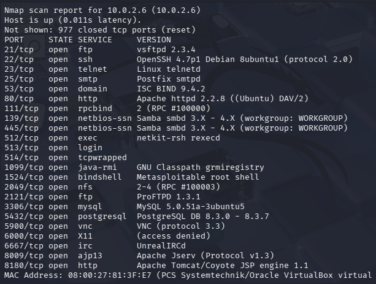

# Домашнее задание к занятию "`Уязвимости и атаки на информационные системы`" - `Милованов Константин`
[Домашнее задание](https://github.com/netology-code/sdb-homeworks/blob/main/13-01.md)

### Задание 1

Скачайте и установите виртуальную машину Metasploitable: https://sourceforge.net/projects/metasploitable/.

Это типовая ОС для экспериментов в области информационной безопасности, с которой следует начать при анализе уязвимостей.

Просканируйте эту виртуальную машину, используя nmap.

Попробуйте найти уязвимости, которым подвержена эта виртуальная машина.

Сами уязвимости можно поискать на сайте https://www.exploit-db.com/.

Для этого нужно в поиске ввести название сетевой службы, обнаруженной на атакуемой машине, и выбрать подходящие по версии уязвимости.

Ответьте на следующие вопросы:

* Какие сетевые службы в ней разрешены?
* Какие уязвимости были вами обнаружены? (список со ссылками: достаточно трёх уязвимостей)

*Приведите ответ в свободной форме.*

### Решение

Сетевые службы, которые разрешены на этой машине:

Уязвимости :

1. vsftpd 2.3.4 — Backdoor Command Execution. Порт: 21 Служба: vsftpd 2.3.4 Описание: Бэкдор позволяет получить обратный shell, если в имени пользователя будут симовлы похожие на "смайлик" :) при подключении по FTP. Ссылка: https://www.exploit-db.com/exploits/17491

2. Samba 3.0.20–3.0.25rc3 — Username Map Script Command Execution. Порты: 139, 445 Служба: Samba smbd 3.X Описание: Удалённое выполнение команд через поддельное имя пользователя. Ссылка: https://www.exploit-db.com/exploits/16320 https://www.exploit-db.com/exploits/13853 https://www.exploit-db.com/exploits/18011

3. UnrealIRCd 3.2.8.1 — Backdoor Command Execution. Порт: 6667 Служба: UnrealIRCd Описание: При подключении к IRC-серверу можно отправить строку вида `bash AB; команда`, и сервер выполнит её как команду ОС. Ссылка: https://www.exploit-db.com/exploits/13872 https://www.exploit-db.com/exploits/18011 UnrealIRCd 3.2.8.1 - Remote Downloader/Execute

---

### Задание 2

Проведите сканирование Metasploitable в режимах SYN, FIN, Xmas, UDP.

Запишите сеансы сканирования в Wireshark.

Ответьте на следующие вопросы:

* Чем отличаются эти режимы сканирования с точки зрения сетевого трафика?
* Как отвечает сервер?

*Приведите ответ в свободной форме.*

### Решение

Результаты сканирования в [файлах](https://github.com/xkostix/sec_attacks): FIN.pcapng, SYN.pcapng, UDP.pcapng, Xmas.pcapng

SYN-сканирование c ключем -sS, отправляет TCP-пакеты с флагом SYN на целевые порты. Если порт открыт, сервер отвечает пакетом SYN-ACK. Если закрыт — отправляет RST.

FIN-сканирование с ключем -sF отправляет TCP-пакеты только с флагом FIN. Если порт закрыт, система отвечает RST; если порт открыт, то ответа нет - пакет игнорируется.

Xmas-сканирование с ключем -sX использует TCP-пакеты с одновременно установленными флагами FIN, PSH и URG. Поведение сервера аналогично FIN-сканированию: RST на закрытые порты, отсутствие ответа на открытые. Этот метод также полагается на корректную реализацию стека TCP/IP и эффективен против систем, следующих стандартам как Metasploitable.

UDP-сканирование с ключем -sU отправляет пустые UDP-дейтаграммы на целевые порты. Если порт закрыт, система отвечает ICMP-сообщением Port Unreachable. Если порт открыт, в большинстве случаев ответа нет.

Таким образом, основное различие между режимами — в способе интерпретации ответа или его отсутствия. Metasploitable, будучи Linux-системой, корректно следует сетевым стандартам, поэтому скрытые методы (FIN, Xmas) работают так же эффективно: отсутствие ответа надёжно указывает на открытый порт, а RST/ICMP — на закрытый.
